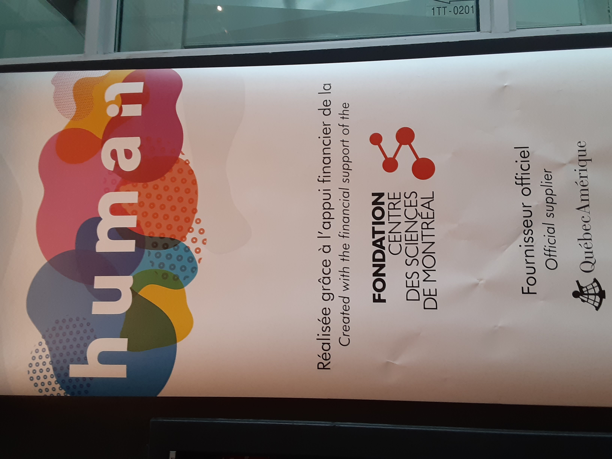
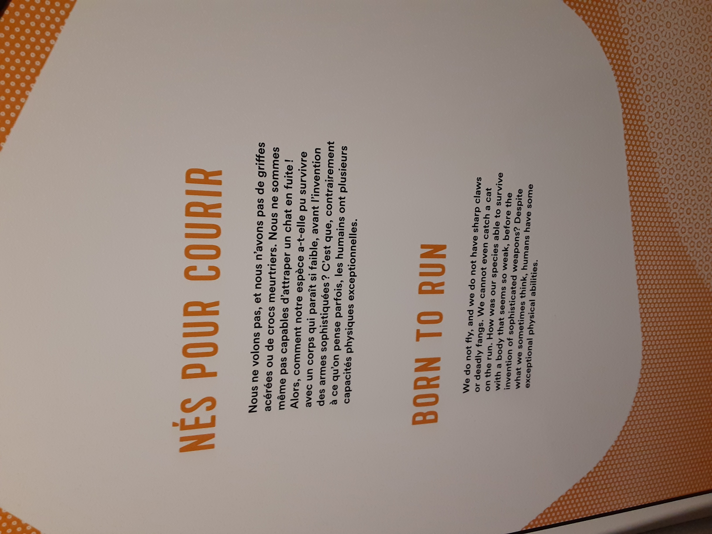
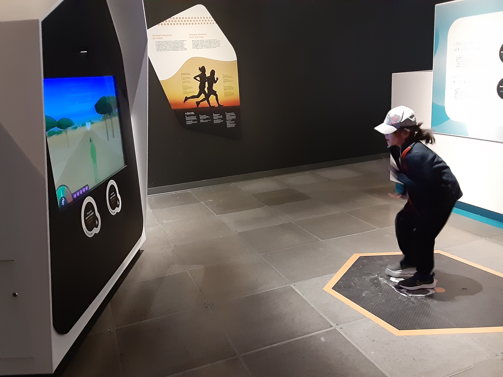
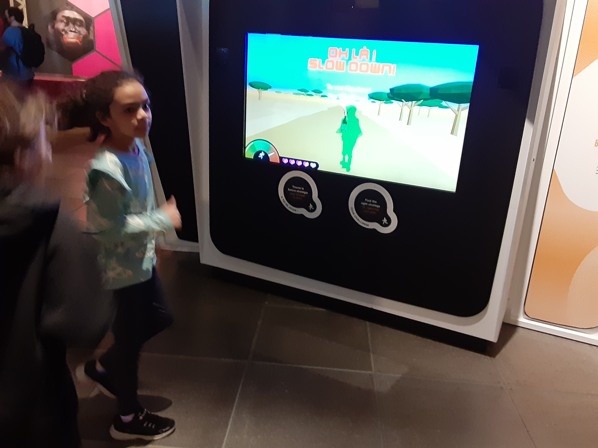
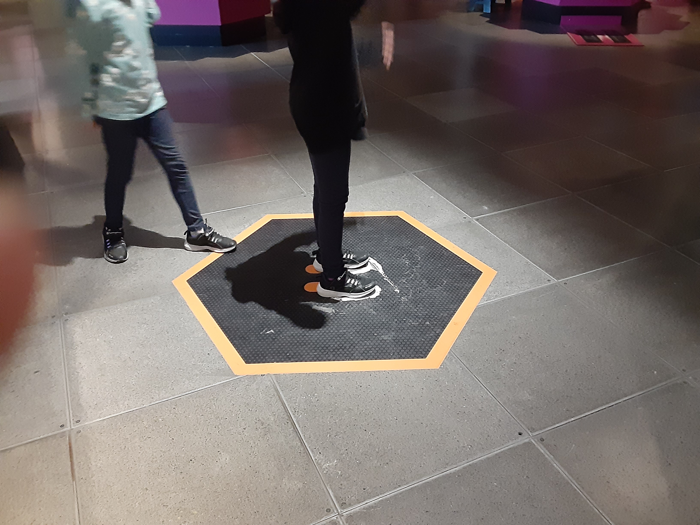
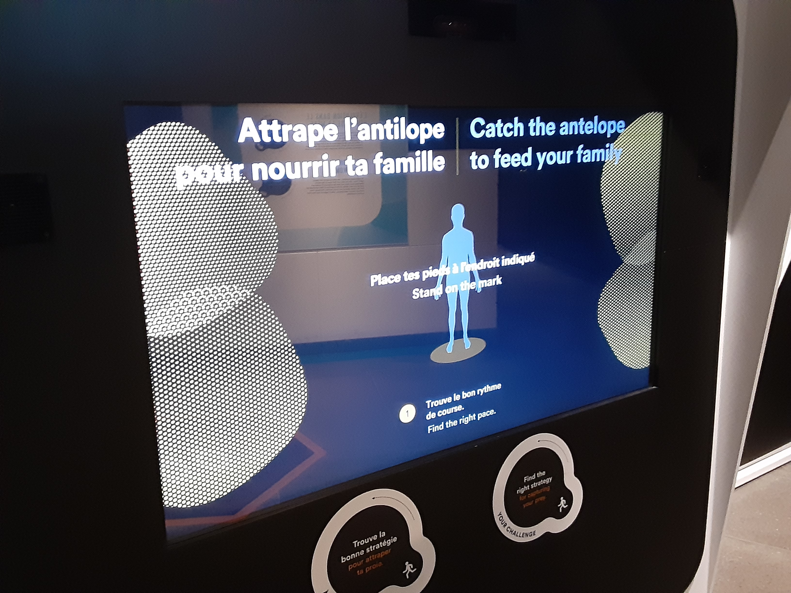
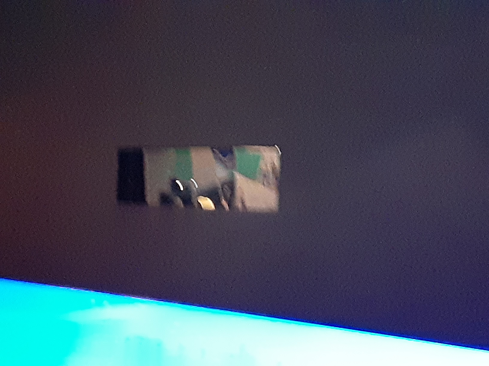

# Centre Des Sciences De Montréal

**Nom de l'exposition:**
Humain

**Lieu de mise en exposition**
Centre des Sciences de Montréal

**Type d'exposition:**
Intérieure

**Date de votre visite:**
18 avril 2023 - 18/04/2023 

**titre de l'oeuvre:**
Nés pour courir

**Nom des artistes:**

**Année de réalisation:** 

**Description de l'oeuvre:**

**Type d'installation: Interactive**

**Fonction du dispositif multimédia**

**Mise en espace:**

**Composantes et techniques:**

**Éléments nécessaires à la mise en exposition:**
Écran

Caméra

**Expérience vécue:**
https://youtube.com/shorts/Y-JJkW1kohU

**Aspect aimer**

La façon que l'installation ne fait pas juste montré, mais laisse l'utilisateur faire un jeu pour mieux apprendre comment leur ancêtres on fait pour survive aussi longtemps durant une époque primitif

**Aspect pas plus:**

Essaye de trouver le bon rhytme de mouvement puisque j'ai remarque que si je bougait seulement mes bras comme si je fessait du rollerskate, j'arrivé a resté dans le milieu de la bar que lorsque je fesait du jogging.

**Référence:**

