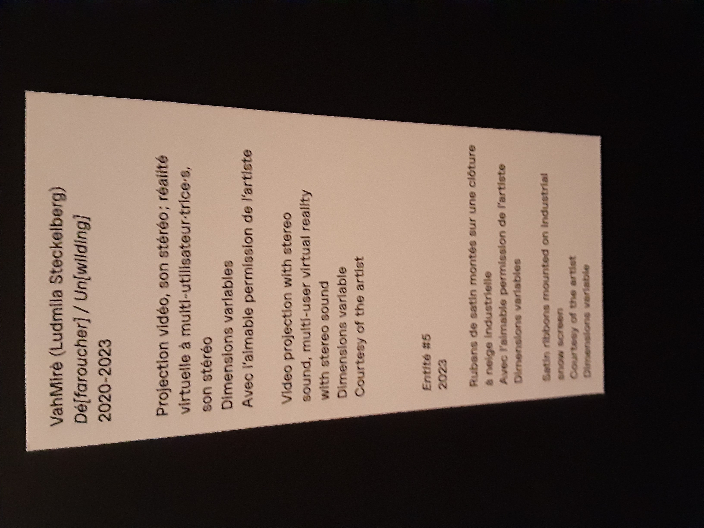
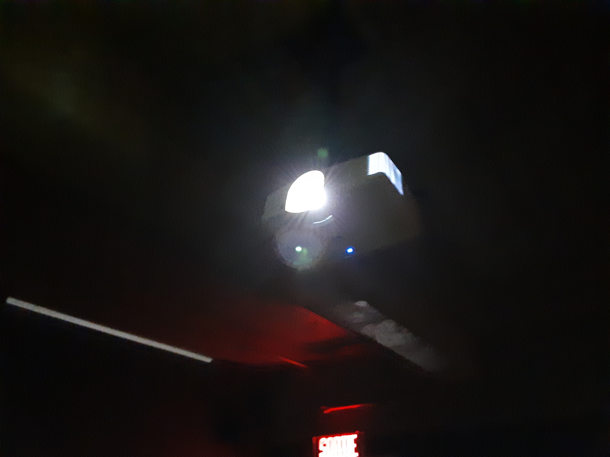

# BIAN

**Nom de l'exposition:**

**Lieu de mise en exposition**
Fondation PHI

**Type d'exposition:**
Intérieure

**Date de votre visite:**
31 mars 2023 - 31/03/2023 

**titre de l'oeuvre:**
VahMirè

**Nom des artistes:**
Ludmilla Steckelberg

**Année de réalisation:** 
2021

**Description de l'oeuvre:**

L'utilisateur utilise un casque vr pour voir certain endroits à Montréal.

**Type d'installation: Interactive**

**Fonction du dispositif multimédia**

**Mise en espace:**

**Composantes et techniques:**

**Éléments nécessaires à la mise en exposition:**

projecteur

**Expérience vécue:**

**Ce qui m'a plu, m'a donné des idées:**

**Aspect que vous ne souhaiteriez pas retenir pour vos propres créations ou que vous feriez autrement et justifications:**

**Référence:**

