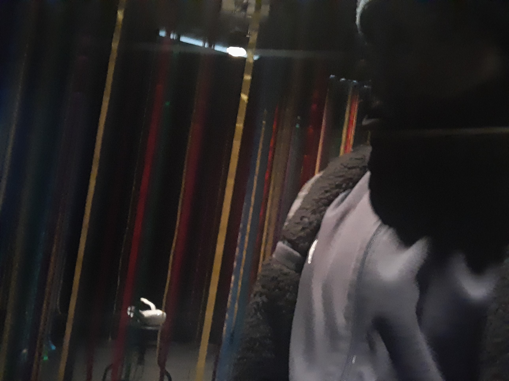
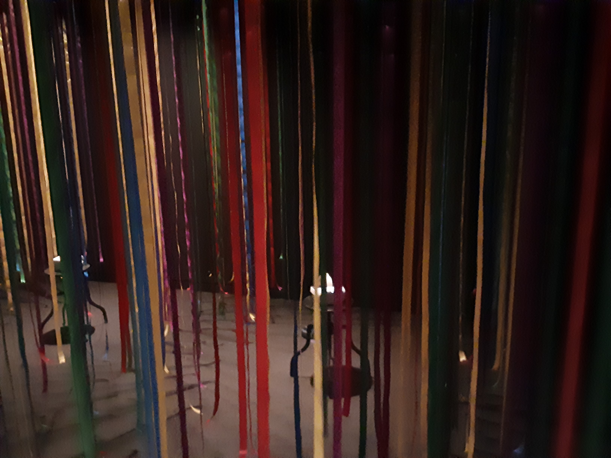

# BIAN

**Nom de l'exposition:**
Condition d'utilisation

**Lieu de mise en exposition**
Fondation PHI

**Type d'exposition:**
Intérieure

**Date de votre visite:**
31 mars 2023 - 31/03/2023 

**titre de l'oeuvre:**
VahMirè

**Nom des artistes:**
Ludmilla Steckelberg

**Année de réalisation:** 
2021

**Description de l'oeuvre:**

L'utilisateur utilise un casque vr pour voir certain endroits à Montréal.

**Type d'installation:** Interactive

**Fonction du dispositif multimédia**
Réalité virtuel

**Mise en espace:**

**Composantes et techniques:**

**Éléments nécessaires à la mise en exposition:**

Projecteur

casque VR

**Expérience vécue:**
https://youtu.be/3zZtTvRpfgs

**Aspect plaisant:**
Le style de présentation qui était comme si c'était fait en fragment de verre ou a la Picasso

**Aspect pas plus:**
C'était impossible de regardé dériere des endrois séléctionné dans le casque

**Référence:**

